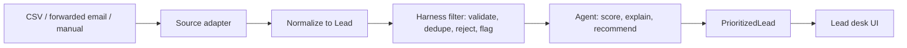

# Shared Contract

## P0 dashboard

The first dashboard supports a ranked lead list, score, priority, 2-3 reasons, exactly one next action, missing information, confidence, and a lead detail view. The shared payload is `PrioritizedLead` in `src/contracts/lead.ts`; `Lead` remains the normalized intake record. Priority ranges are Low 0-39, Medium 40-64, High 65-84, and Urgent 85-100.

Mock endpoints are ready immediately: `GET /api/leads` returns the 12 validated seed leads, `POST /api/prioritize` accepts `{}` or `{ "leads": [...] }` and returns deterministic fake scores, `GET /api/leads/{id}` returns a validated scored detail, and `GET /api/health` is the deployment smoke check. Mock scores are not agent recommendations.

## Decision boundary

The Harness owns intake safety and triage: validate normalized records, detect/dedupe likely duplicate people while preserving source provenance, reject malformed or unusable records, and flag conflicts or missing fields for human review. The pass-through in `src/harness/filterLeads.ts` is only a stub.

The agent owns prioritization after Harness filtering: assign score and priority, cite 2-3 evidence-based reasons, provide one next action, list missing information, and return confidence. It must not silently repair conflicting source facts or claim certainty unsupported by the record. The stub is `src/agent/prioritizeLeads.ts`.

## Retrieval tool

- Name: `get_lead`
- Input: `{ "leadId": "<UUID>" }`, validated by `LeadRetrievalInputSchema`.
- Output: one normalized `Lead` object or `null` when not found.
- Caller: the agent layer only, when it needs the canonical lead record. It must not bypass the Harness intake boundary.
- Stub: `createLeadRetrievalTool` in `src/agent/getLead.ts`; bind it to the repository implementation when persistence is ready. This is a domain contract, not a guessed Strands tool-registration call.

## Data flow

## Out of scope for this sprint

- Production agent prompts, scoring logic, model selection, or live OpenAI calls.
- Production Harness filtering and duplicate resolution.
- Zillow, Realtor.com, or other direct listing-source integrations.
- Production CSV/email parsing; CSV and email-forward adapters are explicit stubs.
- Resend webhook signature verification and a final inbound payload mapping.
- The real lead desk UI, authentication, roles, RLS policies, and production observability.
- Automated outreach, CRM synchronization, scheduling, and property search.

## Open items for Sarah and Shalinthia

- Confirm score-range thresholds and whether score/priority consistency should be strict in production.
- Agree duplicate identity rules, canonical-record selection, and whether duplicates appear in the dashboard.
- Confirm field optionality, currency conventions, and whether seller leads need a distinct contract.
- Confirm the actual Resend inbound event shape and webhook verification approach before implementing its adapter.
- Choose the database/repository path used by the retrieval tool and define the required Supabase RLS policy.
- Add CI checks and then make those checks required in the GitHub `main` branch ruleset.